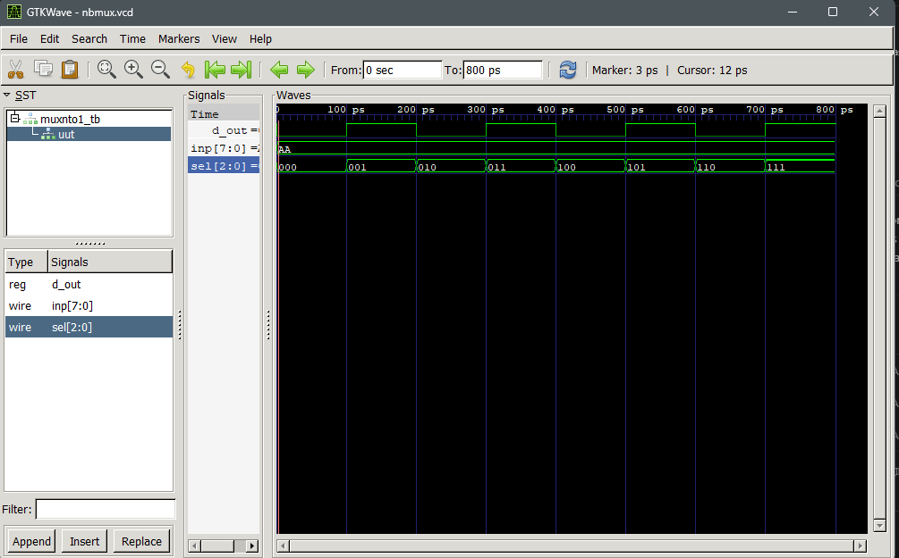

# Assignment 1: N-bit Multiplexer

**Name:** Umesh Khadka  
**Roll No.:** THA079BEI047

## Overview

This assignment implements an 8-to-1 multiplexer in Verilog. A multiplexer selects one signal from several input signals and forwards it to a single output according to the select input.

The design uses an 8-bit input bus (`inp`) and a 3-bit select line (`sel`). Since `N = 8`, the select line can choose any bit from `inp[0]` to `inp[7]`. The selected bit is assigned to the output `d_out` using combinational logic.

## Module Interface

| Signal | Width | Description |
| --- | --- | --- |
| `inp` | 8 bits | Input data bus |
| `sel` | 3 bits | Select line that chooses the input bit |
| `d_out` | 1 bit | Selected output bit |

## Testbench

The testbench applies `inp = 8'b10101010` and iterates `sel` from `0` to `7`. This verifies that the output follows each corresponding bit of the input bus.

### Simulation Waveform

The GTKWave output below shows `d_out` changing according to the selected bit of `inp`.



## Compile and Simulate

Run these commands from this assignment folder using Icarus Verilog:

```powershell
iverilog -o nbmux.vvp nbmux.v nbmux_tb.v
vvp nbmux.vvp
gtkwave nbmux.vcd
```
