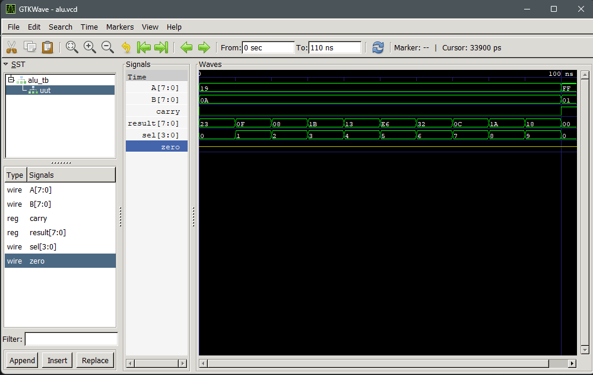

# Assignment 2: * bit ALU

**Name:** Umesh Khadka  
**Roll No.:** THA079BEI047

<h1>Assignment 2: 8-bit ALU</h1>

This project is a simple 8-bit ALU made in Verilog.
It takes two 8-bit inputs (<b>A</b> and <b>B</b>) and a 4-bit select line (<b>sel</b>),
then gives output in <b>result</b>.

<h2>Inputs and Outputs</h2>
<ul>
	<li><b>A</b>: 8-bit input</li>
	<li><b>B</b>: 8-bit input</li>
	<li><b>sel</b>: 4-bit control signal</li>
	<li><b>result</b>: 8-bit output</li>
	<li><b>carry</b>: carry/borrow flag for arithmetic operations</li>
</ul>

<h2>Operations</h2>
<table border="1" cellpadding="6" cellspacing="0">
	<tr>
		<th>sel</th>
		<th>Operation</th>
	</tr>
	<tr><td>0000</td><td>A + B</td></tr>
	<tr><td>0001</td><td>A - B</td></tr>
	<tr><td>0010</td><td>A AND B</td></tr>
	<tr><td>0011</td><td>A OR B</td></tr>
	<tr><td>0100</td><td>A XOR B</td></tr>
	<tr><td>0101</td><td>NOT A</td></tr>
	<tr><td>0110</td><td>A left shift by 1</td></tr>
	<tr><td>0111</td><td>A right shift by 1</td></tr>
	<tr><td>1000</td><td>A + 1 (Increment)</td></tr>
	<tr><td>1001</td><td>A - 1 (Decrement)</td></tr>
</table>

<h2>How It Is Implemented</h2>

The ALU is written using <b>always @(*)</b> and a <b>case(sel)</b> block.
Each value of <b>sel</b> selects one operation.
For add and subtract, both <b>result</b> and <b>carry</b> are updated.

<h2>Simulation</h2>

Use these commands in terminal:

<pre>
iverilog -o alu.vvp alu.v alu_tb.v
vvp alu.vvp
gtkwave alu.vcd
</pre>

<h2>Waveform Image</h2>

ALU waveform/output image:

