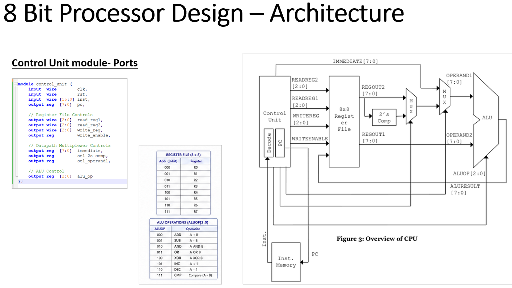
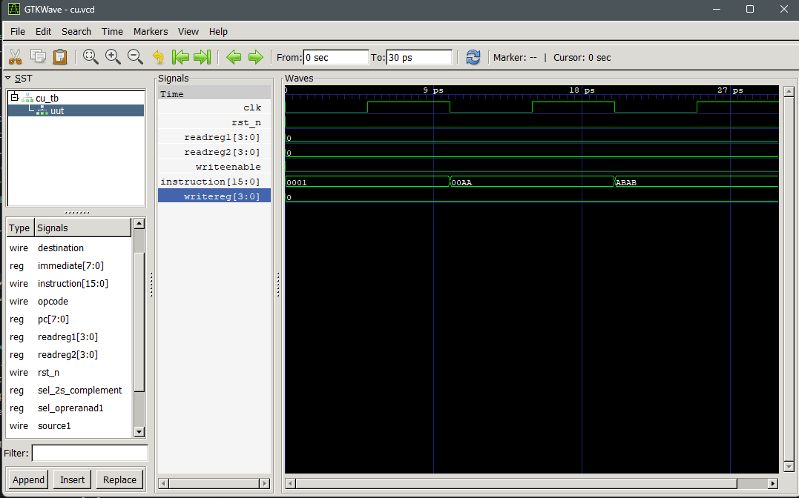

# Assignment 3: Control Unit, Instruction Memory, and 8x8 Register File

**Name:** Umesh Khadka  
**Roll No.:** THA079BEI047

## Overview

This assignment contains three standalone Verilog modules to beused in a basic 8-bit processor architecture: a control unit, an instruction memory, and an 8x8 register file. Each module has its own testbench and is simulated independently in GTKWave.

### Control Unit

The control unit decodes the opcode from a 16-bit instruction and generates control signals for the register file and ALU. It selects the source and destination register addresses, enables register writes, and provides the ALU operation code. The implemented operations are ADD, SUB, AND, OR, XOR, increment, decrement, compare, and load.

The current control-unit module uses the following 16-bit instruction format:

| Bits | Field |
| --- | --- |
| `15:12` | Opcode |
| `11:8` | Source register 1 |
| `7:4` | Source register 2 |
| `3:0` | Destination register |


Here we use two registers `reg1` and `reg2` to store the address of two sources and `writereg` to store the address of destination of the operation. CU gives corresponding ALU op_code as output, ALU takes it as selection input, takes values from address stored in reg1 and reg2 and outputs the result, which is then stored in the address in writereg.

The implemented operations are ADD, SUB, AND, OR, XOR, increment, decrement, compare, and load. The design is triggered on the rising edge of the clock and uses an active-low reset.


> The current control-unit implementation does not yet use the 2's-complement, immediate, or operand-select outputs.

### Instruction Memory

The instruction memory stores sixteen 16-bit words. A 4-bit address selects one memory location, and the corresponding 16-bit instruction appears at the output. In the testbench, sample instruction values are stored in memory and verified through the output waveform.

### 8x8 Register File

The register file contains eight registers (`R0` to `R7`), each 8 bits wide. It has two read-address inputs (`readreg1` and `readreg2`) to provide two output values for ALU operands, and one write-address input (`writereg`) for storing data on the rising clock edge when `writeenable` is high.

## Architecture



## Files

- `cu.v` and `cu_tb.v` - control unit and testbench
- `instruction_memory.v` and `instruction_memory_tb.v` - instruction memory and testbench
- `register_file_8x8.v` and `register_file_8x8_tb.v` - 8x8 register file and testbench

## Compile and Simulate

Run the relevant commands from this assignment folder.

### Control Unit

```powershell
iverilog -o cu_tb.vvp cu.v cu_tb.v
vvp cu_tb.vvp
gtkwave cu.vcd
```

### Instruction Memory

```powershell
iverilog -o instruction_memory_tb.vvp instruction_memory.v instruction_memory_tb.v
vvp instruction_memory_tb.vvp
gtkwave instruction_memory.vcd
```

### 8x8 Register File

```powershell
iverilog -o register_file_8x8_tb.vvp register_file_8x8.v register_file_8x8_tb.v
vvp register_file_8x8_tb.vvp
gtkwave register_file_8x8.vcd
```

## Simulation Waveforms

### Control Unit



### Instruction Memory


### 8x8 Register File


