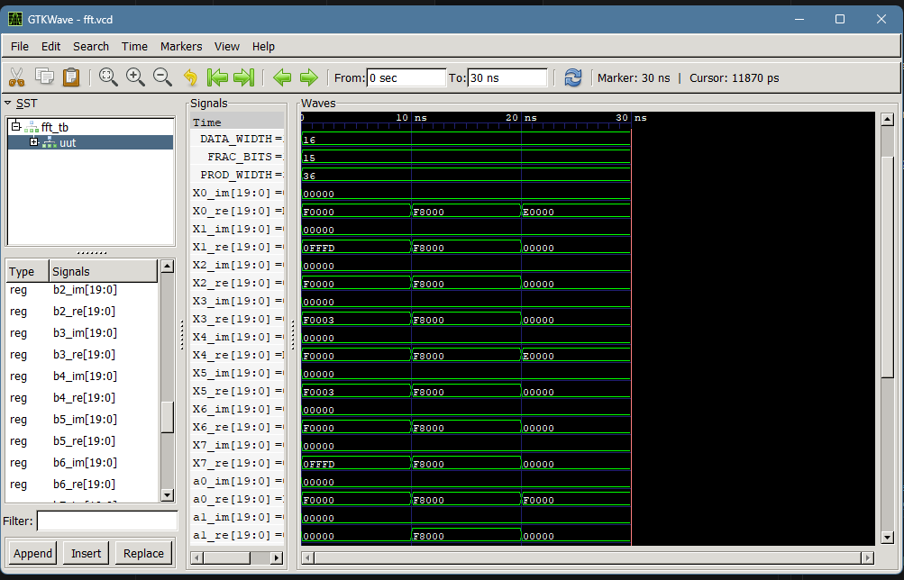

# Assignment 4: 8-Point FFT

**Name:** Umesh Khadka  
**Roll No.:** THA079BEI047

## Overview

This assignment implements an 8-point Fast Fourier Transform (FFT) in Verilog. The design takes eight complex input samples and produces eight complex frequency-domain outputs. The implementation uses fixed-point arithmetic to represent real and imaginary values and performs the FFT using a radix-2 structure.

The module is written as a combinational design and is tested using a Verilog testbench that applies different input patterns to observe the transformed output behavior.

## Module Description

The main module is `fft8`, which accepts:

- 8 real input values: `x0_re` to `x7_re`
- 8 imaginary input values: `x0_im` to `x7_im`

and produces:

- 8 real output values: `X0_re` to `X7_re`
- 8 imaginary output values: `X0_im` to `X7_im`

The design uses a fixed-point format with:

- `DATA_WIDTH = 16`
- `FRAC_BITS = 15`
- `ACC_WIDTH = 20`

This allows the FFT to handle signed values with sufficient internal precision for computation.

## Files

- `fft.v` - Verilog implementation of the 8-point FFT
- `fft_tb.v` - Testbench for simulation
- `fft.vcd` - Waveform dump file generated during simulation
- `waveform.v.png` - Sample waveform image

## Testbench

The testbench applies three different input sequences:

1. A cosine signal at bin 1
2. A unit impulse input
3. A cosine signal at bin 2

These input patterns help verify the FFT output behavior and demonstrate how the frequency-domain results change with different time-domain signals.

## Compile and Simulate

Run the following commands from this folder:

```powershell
iverilog -o fft_tb.vvp fft.v fft_tb.v
vvp fft_tb.vvp
gtkwave fft.vcd
```

## Simulation Waveform

A sample waveform image is included below:



This waveform can also be viewed in GTKWave after running the simulation.
