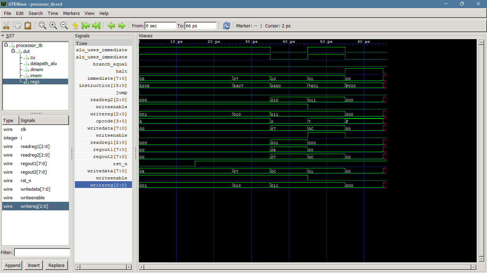

# RISC-V-style CPU Testbenches

These testbenches follow the waveform-oriented style used in the previous FPGA
assignments. Relevant testbench structure was reused from those assignments,
with minor corrections and improvements for the integrated student CPU.

Each testbench is self-contained and targets one module from `../top_modules_cores/`:

- `alu_tb.v`
- `cu_tb.v`
- `data_memory_tb.v`
- `instruction_memory_tb.v`
- `register_file_8x8_tb.v`
- `processor_tb.v`

Compile one testbench with the module files it uses. For example:

```text
cd risc_v/testbenches
iverilog -o processor_tb.vvp processor_tb.v ../top_modules_cores/processor.v ../top_modules_cores/cu.v ../top_modules_cores/alu.v ../top_modules_cores/register_file_8x8.v ../top_modules_cores/instruction_memory.v ../top_modules_cores/data_memory.v
vvp processor_tb.vvp
```

Every testbench calls `$dumpfile` and `$dumpvars`, so the simulation creates a
same-named `.vcd` file in this directory. Open that file with GTKWave, for
example:

```text
gtkwave processor_tb.vcd
```

The other waveform files are `alu_tb.vcd`, `cu_tb.vcd`,
`data_memory_tb.vcd`, `instruction_memory_tb.vcd`, and
`register_file_8x8_tb.vcd`.

## Included waveform

The processor waveform generated from the included testbench is available as
`processor_tb.vcd`. It shows the clock, reset, program counter, instruction
execution, register writes, memory write, and halt signal for the sample CPU
program.


